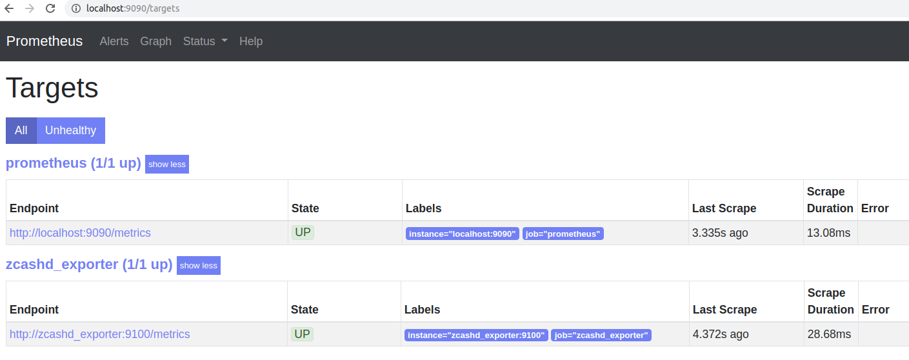
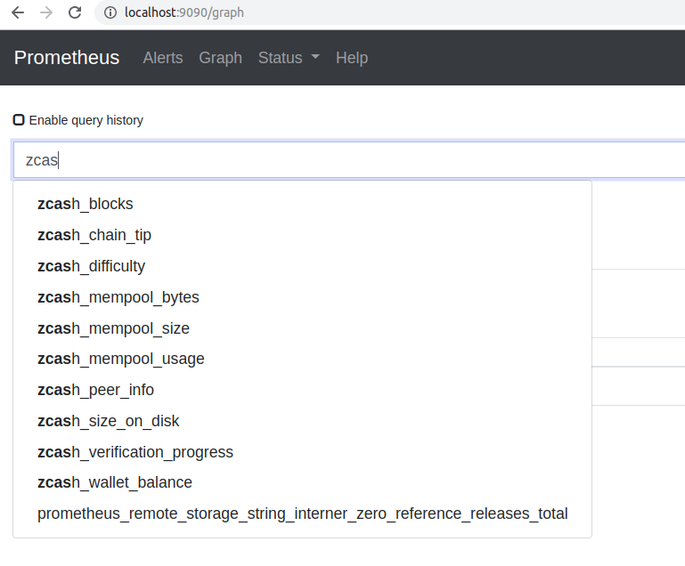

# zcashd_exporter

The `zcashd_exporter` will poll a zcashd node's rpc endpoint, retreive data, then preent it for prometheus to scrape.

## Getting started locally

```
go get -v github.com/zcash-hackworks/zcashd_exporter
go install github.com/zcash-hackworks/zcashd_exporter
$GOPATH/bin/zcashd_exporter --help
```

## Getting Started With docker-compose

### Create zcashd direcotries

Decide where you want to store (or refence existing ) zcashd data.

For example, create 2 new directories:

```
sudo mkdir -p /srv/zcashd/.zcash
sudo mkdir -p /srv/zcashd/.zcash-params
```

Make uid `2001` owner of the directories. This is the uid of user `zcashd` runs as.

```
sudo chown -R 2001 /srv/zcashd/.zcash
sudo chown -R 2001 /srv/zcashd/.zcash-params
```

### Create .env from .env.exmaple

```
cp .env.exmaple .env
```

Edit `.env` if you have any specific changes.

### Install loki docker loging driver

```
docker plugin install  grafana/loki-docker-driver:latest --alias loki --grant-all-permissions
```

### Start docker-compose

Start with
```
docker-compose up -d
```

Check that everything started
```
$ docker-compose ps
              Name                            Command               State                         Ports                       
------------------------------------------------------------------------------------------------------------------------------
zcashdexporter_grafana_1           /run.sh                          Up      0.0.0.0:3000->3000/tcp                            
zcashdexporter_prometheus_1        /bin/prometheus --config.f ...   Up      0.0.0.0:9090->9090/tcp                            
zcashdexporter_zcashd_1            /entrypoint.sh                   Up      0.0.0.0:18232->18232/tcp, 0.0.0.0:28332->28332/tcp
zcashdexporter_zcashd_exporter_1   zcashd_exporter --rpc.host ...   Up      0.0.0.0:9100->9100/tcp  
```

### Check status

zcashd
```
docker logs zcashd_exporter_zcashd_1
```

zcashd_exporter
```
docker logs zcashd_exporter_zcashd_exporter_1
```

If that's looking good, check `prometheus` for metric collection

http://localhost:9090/targets



If that looks good too, start querying

http://localhost:9090/graph

Start typing and metric names will auto-suggest


